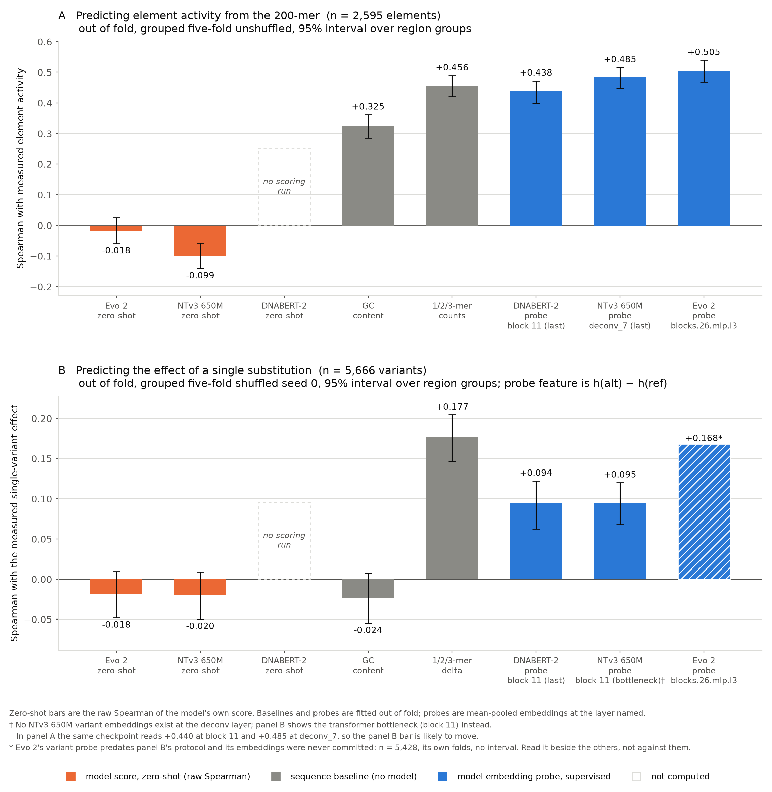

Draft Proposal (WIP): How does Evo 2 scoring track with experimental activity measurement in regulatory sequences?

This project was originally inspired by the desire to uncover whether Evo could detect epistatic interactions in regulatory variants. It has long been known that nearby (cis) regulatory variants can amplify or suppress one another’s effects on gene expression. Siraj et al. analyzed >2,500 pairs of fine-mapped complex-trait variants sitting close together in the same regulatory element and found that 180 had non-additive interactions; 139 were interfering, and 41 were synergistic – in one example, two C alleles at rs9294987 and rs9294988 near THBS2 jointly create a Jun motif and significantly increase reporter activity. Such examples motivated testing whether Evo 2 can predict such interactions, followed by a mechanistic analysis of where and how the interaction signal appears inside the model.

(A) Prior work
Existing studies establish precedents for evaluating genomic models on interacting variants. GraphFLA evaluates Evo 2 across combinatorial fitness landscapes and examines how prediction quality relates to epistasis. Preliminary bacterial analyses include likelihood interaction contrasts and comparisons between embedding-derived and experimentally measured epistasis. CREME interprets Enformer through in silico perturbation and characterizes interactions between regulatory elements as additive, superadditive, and subadditive, but does so without experimental epistasis as ground truth. Phenformer, which stacks a trained transformer on frozen embeddings for phenotype prediction, names Evo as a model that "did not connect the genome sequence to organism-scale polygenic phenotypes." The original intended contribution of this project was a focused evaluation of Evo 2's direct sequence scores on human regulatory variant _pairs_ as well as an account of the computations behind the result. However, more important was the conclusion that Evo underforms on epistasis because it underperforms on single variant scoring itself. 

(B) Aims
Aim 1: Test whether Evo’s existing sequence scores predict experimental interactions.
The recently published Siraj et al. MPRA dataset (Feb 2026) provides activity measurements for reference sequences (R), individual variants (A and B), and their combinations (AB). Interaction labels in Siraj et al. come from a fixed-effect meta-analysis across up to six windows and cell types, with between-window covariance estimated empirically from shared positions, so we can score against the interaction effect. Following Siraj et al., we label them by measured activity rather than by the reference genome: WT is whichever of the four is least active, A and B are the two single changes from it, and AB is the double. For experimental log2 activity y and Evo sequence score s, the expected additive effect minus the observed double is:
ε = y(A) + y(B) − y(WT) - y(AB)
I = s(A) + s(B) − s(WT) - s(AB).
with the same activity-based labelling applied to both, so ε and I always describe the same four sequences in the same order.

A pair with ε > 0 is interfering; a pair with ε < 0 is synergistic, meaning it overshoots. I is defined in the same direction, so positive I can be loosely understood as Evo predicting interference, or some non additive effect.

Aim 2: Investigate why Evo performs that way using mechanistic interpretability.
On a prespecified subset of correctly and incorrectly predicted pairs, we can compare aligned hidden activations across all four genotypes:
Δh = h(A) + h(B) − h(WT) - h(AB)

Following the same convention as ε, positive Δh means the double-mutant activation falls short of that combination and negative Δh means it overshoots. Moving from the additive expectation in either direction is evidence of a non-additive internal computation. As with the sequence scores, we would average the forward and reverse-complement orientations.

We can examine a small, fixed set of layers and positions at or downstream of the variants in each orientation, then relate interaction-sensitive activations to regulatory motifs, using matched controls for generic mutation responses. If we find features that respond strongly to the double mutant but weakly to the reference and either single mutant, or vice versa, the next step would be to patch or ablate these features’ contribution to Evo’s internal activations to better understand how Evo encodes interaction. We can also project activations into SAE features and identify features whose quartet contrast is unusually large. We will examine whether these features correspond to plausible sequence patterns, such as motif creation or disruption, using sequence controls and matched near-additive pairs. We can optionally compare results to activity models such as Borzoi or AlphaGenome

The project should yield a reproducible Python pipeline for computing experimental and Evo-derived epistasis, benchmark metrics comparing Evo 2 interaction scores to measured MPRA interactions, baseline comparisons against zero-interaction, distance-based, and simple regression models, and a short mechanistic case study of several Evo successes and failures.

(3) MVP (Code here)

We selected one cell type, K562, fixed in preprocessing before any scoring. After filtering, there were 2833 quartet groups where all four sequences were present and both variants were single-base substitutions. Every variant sequence had to have at least 20 mean DNA counts and SE of 0.5 or less (one could also weigh each pair by 1/(SE^2) for the log2 RNA/DNA activity measurement). 

Siraj et al. recode alleles by measured activity and take the lowest-activity diplotype as the baseline. There are 58 non-additive pairs in our filtered set out of 2,833 pairs total, which use 2,595 distinct reference 200-mers. Recoded, 86.2% of the 58 left in our filtered dataset are interfering, compared with the paper's published 139 of 180, or 77.2%. Recoding also shifts the mean of ε from -0.00188 to +0.17998 and makes 75.9% of all 2,833 pairs positive. Forcing the "true interaction" to exactly zero for every pair and redrawing all four activities from their published standard errors reproduces a mean of +0.140 to +0.168 and a positive rate of 71.5% to 72.9%, against the observed +0.181 and 76.0% (`scripts/recoding_bias.py`; the observed pair is recomputed from the reconstructed source readings, which is why it differs from +0.17998 and 75.9% in the last decimal). That simulation treats the observed activities as truth, which widens the real spread between diplotypes and makes the baseline easier to identify, so it understates the bias. Whether the paper's 77.2% carries the same bias is untested here. 

The 2,833 pairs fall into 2,251 groups of overlapping genomic regions, accounted for in cross-validation. Siraj et al. assayed each pair in up to six overlapping 200-base windows that shift the variants' position within the oligo – for each quartet, we selected the “middle” window, in which the first variant of the pair sits at position 100; in the retained set the second variant always falls downstream of it, 2 to 89 bases away (a more rigorous analysis would include longer flanking sequence lengths).

The MVP is five workflows on that one dataset. Each asks a narrower question than the last, and every model readout is judged against the same cheap sequence baselines: GC content, and 1, 2, 3 k-mers, where for each 200-base sequence we counted how often each single-letter string appears (4 numbers), each two-letter string (16), and each three-letter string (64), giving 84 numbers per sequence, fitted by ridge regression out of fold. All cross-validation is grouped on the 2,251 overlapping-region groups so that near-identical 200-mers never straddle a fold, and every 95% interval comes from resampling those groups 1,000 times.

**Workflow 1. Whole-element scoring, zero-shot (the null).** Each of the 2,595 distinct reference 200-mers gets one number from the frozen model with no training at all. For Evo 2 (evo2_7b_base) that is the log-likelihood of the sequence. For Nucleotide Transformer v3, a masked language model, we masked one base at a time and added the log probability of the base that is actually there, across all 200 positions. NTv3's U-Net requires a sequence length divisible by 128, so each oligo was padded symmetrically to 256 with N, and only the 200 real positions were scored. Every sequence is scored forward and reverse-complement and the two are averaged. We used the frozen NTv3_100M_pre and NTv3_650M_pre checkpoints; the `_post` models were supervised on functional tracks that may include K562. No DNABERT-2 scoring run exists. The readout is the raw Spearman correlation between the score and measured reference activity.

**Workflow 2. Embedding-based supervised evaluation (element probes).** We pulled embeddings from one layer of three models: Evo 2 at layer 26 (`blocks.26.mlp.l3`, width 4096); DNABERT-2 (117M) at its last transformer layer, block 11 of 12 counting from zero (width 768); and NTv3 650M at the last deconvolution layer of its U-Net, `deconv_7`, which is one vector per base (width 1536). For NTv3 we also read the transformer bottleneck, which is the last transformer block of both the 100M and the 650M model, and, from a per-layer sweep of the 650M model, the early convolution tower. Each representation is mean-pooled to one vector per sequence (for Evo 2 we also kept the last token), and a linear probe, ridge with the regularisation chosen inside each training fold, maps that vector to the measured activity from Siraj et al. We conducted grouped five-fold cross-validation over the 2,251 overlap regions (from the original 2,833 pairs), folds unshuffled. Each probe is judged as its margin over the k-mer baseline, rho(probe) minus rho(k-mers), with a group-bootstrap interval, and it beats the baseline only if that interval excludes zero. When the lower bound lands within 0.01 of zero the interval is redrawn under ten bootstrap seeds and we report how many clear zero instead of a verdict. Spearman and RMSE are reported for every row.

**Workflow 3. Variant effect prediction, zero-shot.** Each quartet contains two single-substitution sequences, giving 5,666 single variants with both a model score change and a measured activity change. The zero-shot readout is the delta score, s(alt) minus s(ref), against the measured log2 activity change of that one substitution in ref/alt coding (the allele recoding used for the interaction contrast does not apply here). We report the rank correlation between the size of the predicted change and the size of the measured change, and the signed correlation. Baselines are fitted out of fold on the same 5,666 variants under a grouped five-fold split shuffled with seed 0: GC content, variant position, ref/alt allele identity, absolute 1/2/3-mer counts, and the 1/2/3-mer delta, the counts in the alternate sequence minus the reference, which for one substitution is the words made and broken.

**Workflow 4. Variant effect prediction, probes.** The probe feature is h(alt) minus h(ref), both vectors from the same layer of the same checkpoint, mean pooled, fitted by ridge to the measured effect under the same grouped folds. A reference-only control, h(ref) alone, checks that the probe is reading the variant and not just the element it sits in, since each reference carries about two variants and can only learn how mutable that element is. This was run for NTv3 100M and 650M at the transformer bottleneck on all 5,666 variants under the shared protocol above, and for Evo 2 at layer 26 and DNABERT-2 at block 11 under `variant_probe.py`'s per-base protocol: 5,428 observations, the model's own units (bases for Evo 2, BPE tokens for DNABERT-2), plus a within-element ranking of which of two variants in the same element matters more, where chance is 0.500. The two protocols put the k-mer baseline at +0.177 and +0.174 respectively, so rows from one are not interchangeable with rows from the other at the third decimal.

**Workflow 5. Epistasis.** Using the frozen evo2_7b_base checkpoint, we could evaluate for each quartet (1) Evo sequence score S (s(A) + s(B) − s(WT) - s(AB)) and (2) experimental activity scoring (ε = y(A) + y(B) − y(WT) - y(AB)). We ran a Spearman correlation between the ranking of Evo interaction I and the ranking of measured epistasis ε across the 2,833 pairs; for uncertainty, we resampled overlapping-region groups 1,000 times and recalculated the statistical measures seen in the figures. Because Evo log-likelihood units and MPRA log2-activity units differ, a supervised straight-line calibration could convert Evo’s interaction score into a useful numerical prediction (“calibrated Evo”). After modeling [experimental activity measurement = intercept + slope × Evo score (calculated above)] where (x,y) = (Evo score, experimental activity measurement), we ran five-fold cross-validation, calculating RMSE on the held-out fold between predicted and measured ε. The same pipeline was run unchanged on the NTv3 100M and 650M scores.

(4) Preliminary results

a) Whole-element scoring: is this 200-mer an active enhancer?

| readout | Spearman with measured reference activity | 95% interval |
|---|---|---|
| Evo 2 log-likelihood | -0.018 | -0.060 to +0.025 |
| NTv3 100M pseudo-log-likelihood | -0.088 | -0.130 to -0.043 |
| NTv3 650M pseudo-log-likelihood | -0.099 | -0.139 to -0.056 |
| DNABERT-2 pseudo-log-likelihood | not run | |
| GC content | +0.328 | +0.292 to +0.363 |
| 1/2/3-mer counts, ridge out of fold | +0.462 | |

No frozen model ranks element activity zero-shot. Comparing predicted score to measured experimental sequence activity across the 2,595 distinct reference 200-mers, Evo 2's log-likelihood correlates with measured reference activity at Spearman -0.018, cluster-bootstrap interval -0.060 to +0.025, whereas counting G and C in the same 200 bases gives +0.328. NTv3 100M gives -0.088, interval -0.130 to -0.043, and NTv3 650M -0.099, interval -0.139 to -0.056, which is weakly negative rather than flat: the more natural a 200-mer looks to NTv3, the less active it tends to be. Fitting ridge regression on the 84 k-mer counts, out of fold under the same grouped five-fold split, correlated with enhancer activity at rank correlation 0.462. (That baseline reads 0.456 in the next section, where the folds are unshuffled; the two protocols should not be compared at the third decimal.)

b) Embedding-based supervised evaluation: what a linear probe recovers from one frozen layer

Same 2,595 elements, same 0.456 word-count baseline, grouped five-fold unshuffled.

| representation | positions pooled | Spearman | RMSE | margin over k-mers, 95% interval | seeds clearing zero |
|---|---|---|---|---|---|
| 1/2/3-mer counts (84 features) | | +0.456 | 1.462 | | |
| Evo 2 `blocks.26.mlp.l3`, mean pooled | 200 | +0.505 | 1.222 | +0.049, +0.015 to +0.081 | |
| Evo 2 `blocks.26.mlp.l3`, last token | 1 | +0.390 | 1.387 | -0.066, -0.102 to -0.034 | |
| DNABERT-2 block 11 (last), mean pooled | ~41 tokens | +0.438 | 1.483 | -0.018, -0.046 to +0.009 | 0 of 10 |
| NTv3 100M transformer bottleneck (block 5, last) | 2 | +0.443 | 1.460 | -0.013, -0.040 to +0.013 | |
| NTv3 650M transformer bottleneck (block 11, last) | 2 | +0.440 | 1.387 | -0.016, -0.048 to +0.015 | |
| NTv3 650M `deconv_7` (last deconv layer) | 256 | +0.485 | 1.338 | +0.029, +0.001 to +0.056 | 7 of 10 |
| NTv3 650M `deconv_6` | 128 | +0.498 | | +0.042, +0.015 to +0.069 | 10 of 10 |
| NTv3 650M `conv_2` | 128 | +0.566 | | +0.109, +0.081 to +0.138 | 10 of 10 |

Frozen embeddings do carry element activity that letter counting misses, and which layer you read matters more than which model you read. Probing out of fold on the same grouped folds against the same 0.456 word-count baseline, Evo 2's blocks.26.mlp.l3 reaches 0.505, a margin of +0.049 (interval +0.015 to +0.081) better than k-mers alone; the last token alone drops to 0.390 and loses to k-mers outright. DNABERT-2's last transformer block reaches 0.438, a margin of -0.018 (-0.046 to +0.009), level with k-mers. NTv3 650M read at its transformer bottleneck reaches 0.440, a margin of -0.016 (-0.048 to +0.015), as seven downsamples leave a 200-base oligo as two positions there; 100M at its own bottleneck is indistinguishable at 0.443. Upon realizing how heavily NTv3 would downsample on a 200 bp sequence, we pivoted. Read at the top of its _deconvolution tower_, one vector per base, it reaches 0.485, but that +0.029 margin sits on the boundary: its lower bound changes sign with the bootstrap seed, clearing zero in 7 of 10. Read in the early convolution tower instead, at conv_2 and 128 positions, it reaches 0.566, a margin of +0.109 (+0.081 to +0.138), the largest of any representation we tested and more than double Evo 2's. That layer was chosen after seeing the per-layer curve, which inflates the winner, and 18 of the 26 layers in the 650M sweep are non-finite and need re-running, including every transformer block, so the middle of the U is unmeasured. All of this predicts reference activity rather than variant interaction. A more thorough sweep of Evo2's layers will be required to determine whether there is a better layer to run the same experiment on -- particularly layer 28.

c) Variant scoring, zero-shot: what does changing one base do?

Measurement reliability on this task is 0.731, so no predictor of the signed effect can exceed a Spearman of 0.855.

| model, delta score s(alt) - s(ref) | magnitude Spearman, 95% interval | signed Spearman, 95% interval |
|---|---|---|
| Evo 2 | -0.006, -0.034 to +0.022 | -0.018, -0.048 to +0.010 |
| NTv3 100M | -0.005, -0.034 to +0.022 | -0.038, -0.069 to -0.012 |
| NTv3 650M | +0.035, +0.009 to +0.062 | -0.020, -0.050 to +0.009 |
| DNABERT-2 | not run | not run |

| baseline, ridge out of fold on the same 5,666 variants | Spearman, 95% interval |
|---|---|
| variant position | -0.037 |
| 1/2/3-mer counts, absolute | -0.035 |
| GC content | -0.024, -0.055 to +0.008 |
| ref/alt allele identity | +0.082 |
| 1/2/3-mer delta, words made and broken | +0.177, +0.147 to +0.204 |
| 1/2/3-mer delta + Evo 2 delta score | +0.176 |
| 1/2/3-mer delta + NTv3 100M delta score | +0.177 |

First, Evo does not rank single-variant effects. Each quartet contains two single-substitution sequences, giving 5,666 single variants with both an Evo score change and a measured activity change. The rank correlation between the size of Evo's predicted change and the size of the measured change is -0.006, (95% CI -0.034 to +0.022). On single variants NTv3 100M gives Spearman -0.005 (CI -0.034 to +0.022) against Evo's -0.006, and NTv3 650M +0.035 (+0.009 to +0.062), the only zero-shot readout whose interval lies above zero, and still a fifth of what the words made and broken by the substitution give. Adding either model's delta score to the k-mer delta changes nothing (margins of -0.0006 for Evo 2 and -0.0003 for NTv3, both intervals containing zero). The best readout on this task reaches 21% of the measurement ceiling.

d) Variant scoring, probes: does the model's representation change in a useful way?

Shared protocol, 5,666 variants, grouped five-fold shuffled seed 0, feature h(alt) - h(ref) mean pooled:

| readout | Spearman, 95% interval | reference-only control |
|---|---|---|
| 1/2/3-mer delta (baseline) | +0.177, +0.147 to +0.204 | |
| NTv3 100M probe, transformer bottleneck (block 5) | +0.116, +0.086 to +0.146 | -0.036 |
| NTv3 650M probe, transformer bottleneck (block 11) | +0.095, +0.068 to +0.120 | -0.038 |
| DNABERT-2 probe, block 11 (last) | +0.094, +0.062 to +0.122 | |

`variant_probe.py` protocol, 5,428 observations, per-unit embeddings, no interval:

| readout | Spearman | RMSE | within-element ranking (chance 0.500) |
|---|---|---|---|
| k-mer difference (84) | +0.174 | 0.404 | 0.556 |
| Evo 2 `blocks.26.mlp.l3`, difference mean pooled over 200 bases | +0.168 | 0.400 | 0.568 |
| Evo 2, difference at the variant base only | +0.110 | 0.408 | 0.534 |
| Evo 2, reference embedding only (control) | -0.013 | 0.415 | 0.501 |
| DNABERT-2 block 11, difference mean pooled over ~41 tokens | +0.089 | 0.409 | 0.518 |
| DNABERT-2, difference at the variant token only | +0.075 | 0.410 | 0.523 |
| DNABERT-2, reference embedding only (control) | -0.011 | 0.411 | 0.497 |
| predict the mean | 0.000 | 0.409 | 0.500 |

Every difference probe beats its reference-only control, so the probes are reading the variant rather than the genomic background, but none of them reaches the k-mer delta. Evo 2's is the closest, +0.168 against +0.174 on its own protocol, and it does the best job of ranking two variants within the same element, 0.568 against 0.556 for the k-mer difference; that run has no interval and its embeddings were not committed, so it is read beside the other rows rather than against them. NTv3's variant probes exist only at the transformer bottleneck; no variant embeddings have been taken at the deconv or conv layers that won the element task, so the panel B bar for NTv3 is likely to move.

e) Epistasis

| comparison | Evo 2 7B | NTv3 100M | NTv3 650M | comments |
|---|---|---|---|---|
| Spearman's rank correlation of model interaction score versus measured epistasis | 0.0205, 95% interval -0.0190 to 0.0589 | 0.0211, -0.0172 to 0.0585 | 0.0351, 0.0003 to 0.0713 | Almost no rank association |
| Pearson correlation of model score versus measured epistasis | 0.0030, 95% interval -0.0366 to 0.0409 | -0.0115, -0.0488 to 0.0249 | 0.0310, -0.0065 to 0.0672 | Almost no linear association |
| RMSE of out-of-fold calibrated prediction (rescaled) versus measured epistasis | 0.30498 | 0.30481 | 0.30471 | Measurement of how close model-based numerical predictions are to experimental reality |
| RMSE of training-fold mean reference versus measured epistasis | 0.30478 | 0.30478 | 0.30478 | Another prediction |
| gain over the training-fold mean, 95% interval | -0.00042 to -0.00002 | -0.00015 to +0.00010 | -0.00030 to +0.00044 | none of the three clears zero |
| RMSE of zero prediction versus measured epistasis (Predicted score = 0 for every pair; additive assumption) | 0.35376 | 0.35376 | 0.35376 | Simple reference prediction |
| RMSE floor for a predictor limited only by measurement error | 0.29894 | 0.29894 | 0.29894 | Against the training-fold mean the competitive range is only 0.0058 wide; the 0.055 gap to the zero baseline is the recoded mean of ε, which any constant predictor already captures |

Note: While activity (the measured output) is not 1:1 comparable with Evo’s predicted “naturalness” score, an enhancer's only job is turning genes on. So, to an extent, in this case, "does this variant matter" and "does it change how much the gene turns on" are the same question. 

Int_emVar is the source dataset’s Boolean flag for an interaction expression-modulating variant pair. After quality control, reducing the dataset to 2833 pairs, 58 were flagged as statistically significantly nonadditive (2.05%). Across all 2,833 pairs, the calibrated Evo prediction was no more accurate than predicting a constant. Recoding makes ε about 76% positive, so the constant to beat is the training-fold mean rather than zero. Calibrated Evo has RMSE 0.30498 against 0.30478 for the training-fold mean, and the cluster-bootstrap interval on that gap runs -0.00042 to -0.00002, entirely on the wrong side. Both beat the zero-interaction reference at 0.35376, which only reflects the nonzero mean of recoded ε, and that mean is itself mostly a recoding artifact, so the 0.055 gap to the zero baseline overstates the room a model ever had. This indicates that under these MVP conditions, Evo’s score adds essentially no predictive information beyond a trivial baseline, consistent with the near-zero correlation between Evo’s interaction score and measured epistasis. The four-way Evo likelihood difference does not usefully order the measured interactions in this dataset. NTv3 650M is the only model whose rank correlation interval excludes zero, at +0.035 with a lower bound of +0.0003, and its calibrated prediction still does not beat the training-fold mean. Across our pairs, the variance of measured epistasis is 0.12514, and the mean squared standard error is 0.08937. Error increases for larger measured epistasis values, meaning Evo particularly fails on the biologically interesting, strongly non-additive cases identified by Siraj et al. Notably, the full-dataset RMSE is dominated by the large number of small-effect pairs, while the strongly non-additive pairs are both rare and noisy, but the overall conclusion remains supported by the near-zero correlation and lack of improvement over the additive baseline; performance specifically on Siraj’s identified non-additive subset remains to be established. 

(5) Some Next Steps

Compare MPRA-based preference tuning, inspired by ProteinDPO, with ordinary supervised fine-tuning, to understand whether preference alignment with MPRA activity can install regulatory signals that pretraining demonstrably failed to learn. 

My current eval generally asks whether Evo can predict measured epistasis across every retained pair in this quality-controlled subset of Siraj’s data. A separate evaluation asks, among pairs Siraj identified as non-additive, can Evo predict the direction and magnitude? 
Test whether extending the current 200-bp sequences with native genomic context improves prediction; additional flanking sequence provides genomic context that may improve predictive accuracy over null.
If zero-shot performance remains indistinguishable from the null, determine whether useful interaction information exists in Evo’s representations or can be learned through supervised adaptation.

Compare sequence-only predictions with predictions that also receive cell information, such as cell identity or a prespecified expression profile.
Extract matched WT/A/B/AB embeddings at prespecified layers and positions. Train small, regularized probes to predict measured epistasis from the four embeddings or their interaction contrast. For features that seem to play a role in predicting variant interaction, we can examine matched sequence changes, motif annotations, spacing, and cell dependence, playing with feature activations at aligned positions to see how such changes move predictions.
Resolve whether sequence pairs with additive effects lie closer together in Evo’s embedding space than sequence pairs with nonadditive effects – and whether contrastive learning, teaching the embedding space specifically about additive and nonadditive genetic interactions, could improve results.
Compare MPRA-based preference tuning, inspired by ProteinDPO, with ordinary supervised fine-tuning, to understand whether preference alignment with MPRA activity can install regulatory signals that pretraining demonstrably failed to learn. 
Resolve whether selective transfer of background-dependent mutation effects, evaluated against measured phenotypes and held-out sequence combinations.

